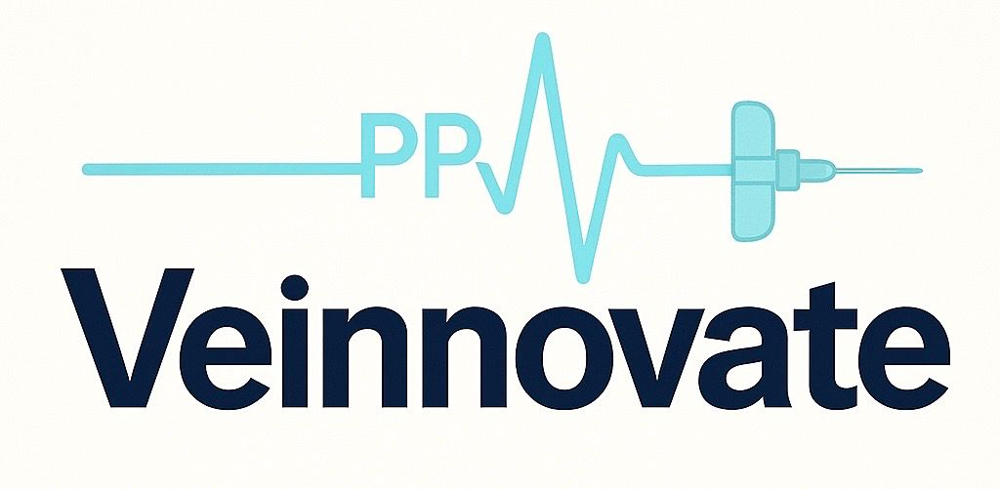
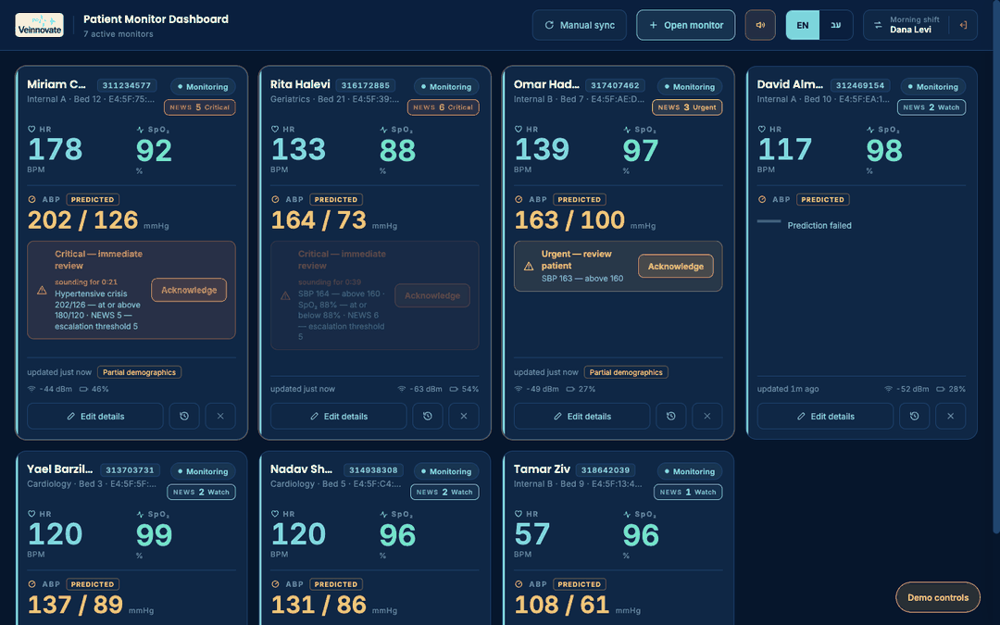
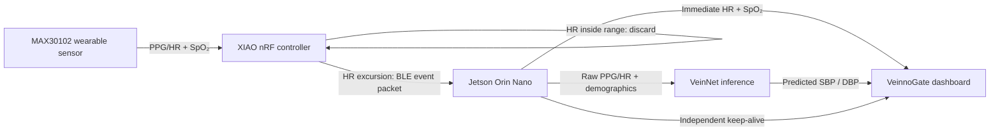

# VeinnoGate Patient Monitor Dashboard

<p align="center">
  
</p>

<p align="center">
  A calm, event-driven patient monitoring interface for wearable PPG telemetry and VeinNet blood-pressure prediction at the edge.
</p>

<p align="center">
  <strong>Private prototype</strong> · <strong>English + Hebrew</strong> · <strong>Jetson edge workflow</strong> · <strong>Synthetic demo data</strong>
</p>

<p align="center">
  <a href="https://veinnogate-dashboard-monitor-8nl3fuqje-asnin-s-projects.vercel.app/VeinnoGate%20Dashboard.dc.html"><strong>Open the protected live demo</strong></a>
  &nbsp;·&nbsp;
  <a href="ENGINEERING_PROTOCOL.md">Read the integration protocol</a>
</p>



> [!IMPORTANT]
> This repository contains a visual and interaction prototype. Every patient identity and clinical value shown in the demo is synthetic. It is not a medical device and is not cleared for clinical use.

## What this project is

VeinnoGate is a multi-patient dashboard designed for a hospital workstation connected to a Jetson Orin Nano edge unit. Each active wearable adapter receives one monitor tile.

The dashboard presents only three clinical values:

| Value | Meaning | Source |
|---|---|---|
| **HR** | Heart rate in beats per minute | Calculated on the wearable from the PPG/HR signal |
| **SpO₂** | Peripheral oxygen saturation | Measured by the MAX30102 and passed through unchanged |
| **ABP** | Predicted systolic/diastolic arterial pressure | Predicted by VeinNet on the Jetson from raw PPG/HR plus demographics |

The raw PPG waveform is never displayed. It remains on the Jetson and is used only as model input.

## How the system works



The dashboard communicates only with the Jetson. It does not connect directly to the wearable or manage BLE itself.

## Product experience

- **Unlimited monitor grid** — one responsive tile for every active adapter.
- **Event-driven updates** — HR and SpO₂ appear immediately when a packet arrives; ABP joins after inference.
- **Clear prediction language** — ABP is always marked **Predicted**, never presented as a cuff measurement.
- **Coherent synthetic physiology** — demo HR, SpO₂ and ABP values are generated from one shared patient profile.
- **Partial NEWS2 view** — a clearly labelled score based only on pulse, SpO₂ and systolic pressure.
- **Actionable alert tiers** — routine, watch, urgent and critical visual states with acknowledgement.
- **Connection awareness** — independent event timestamps, keep-alive status, BLE signal quality and battery level.
- **Safe patient workflow** — identification, demographics, audit history, discharge confirmation and 10-second undo.
- **Shift handover** — records the current charge nurse and the person who entered a change.
- **Bilingual interface** — complete English LTR and Hebrew RTL layouts.
- **Built-in demo controls** — reproduce packets, model failures, critical events, disconnects and server loss.

## Try the live demo

1. Open the **protected live demo** using the link at the top of this page.
2. Complete the hosting access check with an approved account.
3. On the VeinnoGate sign-in screen, choose **Continue with hospital SSO** for the synthetic demonstration.
4. Open **Demo controls** in the lower corner.
5. Try **Packet**, **Fail**, **Crisis** and **Disconnect** on any patient monitor.

The demo runs fully in the browser. It makes no network request to clinical infrastructure and contains no real patient data.

## Reading a monitor tile

| Visual element | What it means |
|---|---|
| Cyan heart + **HR** | Measured heart rate, shown in BPM |
| Mint pulse line + **SpO₂** | Measured oxygen saturation, shown as a percentage |
| Amber gauge + **ABP** | VeinNet-predicted systolic/diastolic pressure, shown in mmHg |
| **Predicted** label | Confirms that ABP is a model result, not a direct measurement |
| Coloured status dot | Current monitor state: awaiting details, monitoring, predicting, disconnected or closing |
| **NEWS** chip | Partial NEWS2 score and current escalation tier |
| Alert triangle | A dashboard threshold requires review |
| **Acknowledge** | Silences and clears the current UI alert while preserving the latest values |
| Wi-Fi-style signal icon | BLE RSSI reported to the dashboard by the Jetson |
| Battery icon | Wearable battery percentage |
| **Partial demographics** | One or more model features are unknown and use the training-group fallback |
| Pencil | Edit patient identification or demographics |
| Circular history arrow | Open the field-level change log |
| × | Begin discharge and monitor closure; a 10-second undo window follows |

<details>
<summary><strong>Complete header and control reference</strong></summary>

| Control | Purpose |
|---|---|
| **Manual sync** + refresh icon | Requests the current adapter list from VeinnoGate when automatic discovery needs a fallback |
| **Open monitor** + plus icon | Manually pairs an available adapter and opens a new monitor |
| Speaker icon | Mutes or restores dashboard alert sound |
| **EN / עב** | Switches the complete interface between English LTR and Hebrew RTL |
| Opposing arrows + shift name | Opens shift handover and identifies the current charge nurse |
| Exit icon | Signs the current user out of the visual prototype |
| **Demo controls** amber dot | Opens the synthetic event panel used to demonstrate system states |

</details>

<details>
<summary><strong>Complete monitor-state reference</strong></summary>

| State | Display behaviour |
|---|---|
| **Awaiting details** | Adapter detected; patient identity and demographics still need to be entered |
| **Monitoring** | Patient is identified, the keep-alive is healthy and the tile is waiting for or displaying event data |
| **Predicting** | HR and SpO₂ are available while VeinNet computes the ABP prediction |
| **Disconnected** | Last known values are frozen and dimmed; patient details remain available |
| **Closing** | Discharge was confirmed and a 10-second undo countdown is active |

Disconnected monitors move behind active and alerting monitors so urgent information remains visible first.

</details>

<details>
<summary><strong>Complete demo-control reference</strong></summary>

| Demo action | Result |
|---|---|
| **Power on new adapter** | Creates an unassigned adapter and opens the identification workflow |
| **Toggle VeinnoGate link** | Simulates loss or recovery of the Jetson/dashboard connection |
| **Reset all** | Restores the seeded synthetic ward state |
| **Packet** | Sends a coherent synthetic event packet and starts VeinNet inference |
| **Fail** | Sends a packet whose ABP inference ends in a visible prediction failure |
| **Crisis** | Generates a severe synthetic result to demonstrate the critical-alert treatment |
| **Disconnect / Connect** | Simulates adapter link loss and reconnection |

</details>

## Patient and model-input workflow

When a new adapter is detected, the dashboard collects basic identification first:

- Patient name
- National ID
- Department
- Bed
- Person recording the change

The second step collects VeinNet inputs in a fixed order:

1. Age
2. Sex
3. Hypertension
4. Congestive heart failure
5. Myocardial infarction
6. Stroke
7. Arrhythmia
8. Valve disease
9. Respiratory failure

Unknown values are valid and never block monitoring. The model uses its training-group fallback for missing features, and the tile receives a subtle **Partial demographics** label. Updating demographics affects future predictions only.

## Data timing and safety model

VeinnoGate uses two independent channels:

| Channel | Carries | Why it matters |
|---|---|---|
| **Event packet** | HR, SpO₂ and raw PPG/HR for inference | Updates clinical values only when the wearable detects an HR excursion |
| **Keep-alive** | Battery, RSSI and liveness | Separates a quiet patient from a disconnected adapter |

The event timestamp and keep-alive timestamp must remain separate during integration.

## Local preview

No package installation or build step is required.

```bash
python3 -m http.server 4173
```

Then open:

```text
http://127.0.0.1:4173/VeinnoGate%20Dashboard.dc.html
```

For the fastest demo entry, select **Continue with hospital SSO**.

## Repository map

| Path | Purpose |
|---|---|
| `VeinnoGate Dashboard.dc.html` | Complete dashboard markup, styles, state model and synthetic demo logic |
| `support.js` | Local runtime used by the self-contained dashboard document |
| `ENGINEERING_PROTOCOL.md` | Integration contract, state machine, timing, thresholds and implementation notes |
| `uploads/PROJECT_CONTEXT.md` | Full product and system context in Hebrew |
| `assets/` | Product identity assets used by the dashboard |
| `docs/assets/` | README animation and visual preview assets |

## Integration boundary

This repository is the dashboard layer only. Production integration must replace synthetic values with Jetson telemetry while preserving the documented UI states, prediction labelling, timestamp separation, audit trail and safety behaviours.

Read [`ENGINEERING_PROTOCOL.md`](ENGINEERING_PROTOCOL.md) before connecting hardware, inference services or patient-record systems.

---

<p align="center">
  <strong>Veinnovate · VeinnoGate</strong><br>
  Edge intelligence presented with clinical clarity.
</p>
